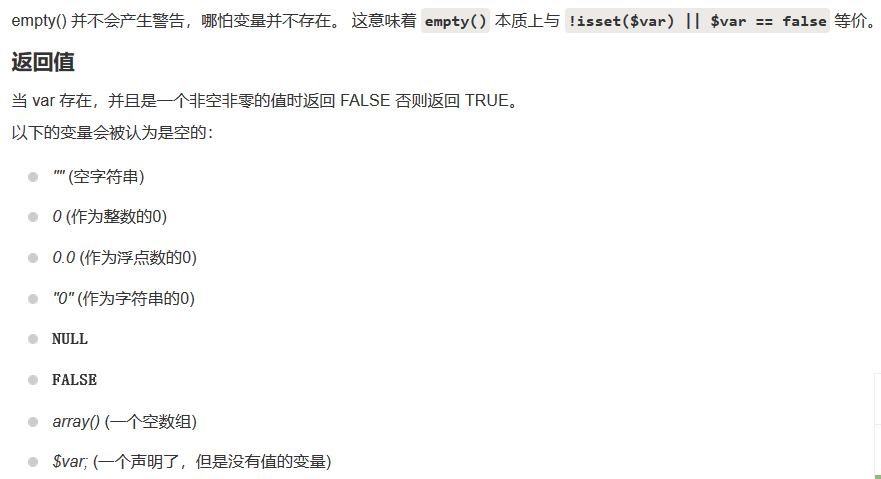
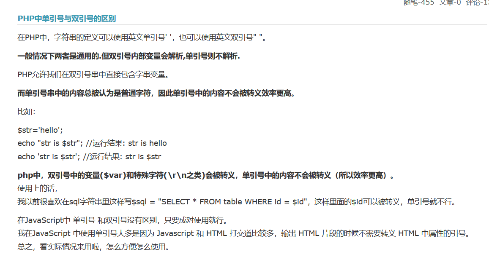

## php综合题

### 1. **变量如何定义？**

  ```php
  $
  
  变量以 $ 符号开头，其后是变量的名称
  
  变量名称必须以字母或下划线开头
  
  变量名称不能以数字开头
  
  变量名称只能包含字母数字字符和下划线（A-z、0-9 以及  _）
  
  变量名称对大小写敏感（$y 与 $Y 是两个不同的变量）
  ```

### 2. **如何检查变量是否定义？**
    isset()

### 3. **如何删除一个变量？**
    unset()

### 4. **判断一个变量是否为空的函数？**
    empty()

### 5. **什么是可变变量？**
    获取一个普通变量的值作为这个可变变量的变量名。

  ```php
  什么是可变变量？
  
  PHP提供了一种其他类型的变量——可变变量。可变变量允许我们动态地改变一个变量的名称。
  可以看到，在这方面，PHP具有非常大的自由度——所有的语言都允许改变变量的值，但是并没有太多的语言允许改变变量的类型，至于支持改变变量的名称的语言就更少了。
  
  这个特性的工作原理是用一个变量的值作为另一个变量的名称。例如：
  
  $varname = 'tireqty';
  
  
  
  于是，我们就可以用
  
  $$varname = 5;
  
  
  
  这个代码等价于：
  
  $tireqty = 5;
  
  
  在实际使用中，我们可以不用单独列出并使用每一个表单变量，我们可以使用一个循环语句和一个变量来自动处理它们。结合“for循环”，举例如下：
  orderform.html的主要内容
  
  [php] view plain copy
  <pre name="code" class="html"><form action="test.php" method="post">  
  <table border="0">  
  <tr bgcolor="#cccccc">  
  <td width="150">Item</td>  
  <td width="15">Quantity</td>  
  </tr>  
  <tr>  
  <td>Tires</td>  
  <td align="center"><input type="text" name="tireqty" size="3" maxlength="3" /></td>  
  </tr>  
  <tr>  
  <td>Oil</td>  
  <td align="center"><input type="text" name="oilqty" size="3" maxlength="3" /></td>  
  </tr>  
  <tr>  
  <td>Spark Plugs</td>  
  <td align="center"><input type="text" name="sparkqty" size="3" maxlength="3" /></td>  
  </tr>  
  <tr>  
  <td colspan="2" align="center"><input type="submit" value="Submit Order" /></td>  
  </tr>  
  </table>  
  </form>  
  
  
  表单处理文件test.php
  传统的中规中矩的写法
  
  [php] view plain copy
  <?php  
  $oilqty = $_POST['oilqty'];  
  $tireqty = $_POST['tireqty'];  
  $sparkqty = $_POST['sparkqty'];  
  echo "<p>Your order is as follows:</p>";  
  echo "<br />\$oilqty=".$oilqty;  
  echo "<br />\$tireqty=".$tireqty;  
  echo "<br />\$sparkqty=".$sparkqty;  
  ?>  
  
  
  如果orderform.html里有很多表单变量，可以想像上面的赋值语句将会很长，而我们采用可变变量就可以优化为如下非常简洁的代码：
  
  [php] view plain copy
  <?php  
  foreach ($_POST as $key => $value) {  
  $$key = $value;  
  }  
  echo "<p>Your order is as follows:</p>";  
  echo "<br />\$oilqty=".$oilqty;  
  echo "<br />\$tireqty=".$tireqty;  
  echo "<br />\$sparkqty=".$sparkqty;  
  ?>  
  
  
  ```

  ```php
  延伸
  
  什么是PHP可变函数？
  
  PHP 支持可变函数的概念。这意味着如果一个变量名后有圆括号，PHP 将寻找与变量的值同名的函数，并且尝试执行它。可变函数可以用来实现包括回调函数，函数表在内的一些用途。
  
  可变函数不能用于例如 echo，print，unset()，isset()，empty()，include，require 以及类似的语言结构。需要使用自己的包装函数来将这些结构用作可变函数
  
  php可变函数应用实例：
  
  for example:
  
  我们在前端通过GET传一个name为myfunc1的值(www.admin122.com/?name=myfunc1)，这个值是你要调用的函数名
  
  [php] view plain copy
  $f=$_GET['name'];  
  $f();  
  function myfunc1(){  
  }  
  
  
  再来个例子，这次换成class和function一起
  有class A和class B以及class C，他们都有自己的函数
  还是前端传值，这次是两个一个class，一个function
  同样的
  
  [php] view plain copy
  $class=$_GET['class'];  
  $func=$_GET['func'];  
  $obj=new $class();  
  $obj->$func();  
  
   
  这是做单入口模式的思路。PHP框架的思想。
  
  转载自：https://blog.csdn.net/river131/article/details/50598750
  
  多说一嘴：本来以为只是可变变量只是把原变量的值作为新变量的名字：
  
  $first ="hello";
  $hello ="world";
  echo $first." ".$$first;
  结果是  hello world
  
    
  
  后来看完博主的博客才知道，原来在foreach循环里面，还可以每次动态的给变量赋值，
  
  //这一句代码实在是秒
  $$key = $value
  
  
  end
  ```

  

### 6. **php中变量有哪些基本数据类型？**
    php支持8种原始数据类型。
    包括：
    四种标量类型（布尔型boolean，整型integer，浮点型float/double , 字符串string）
    两种复合类型(数组array ， 对象object)
    两种特殊类型（资源resource，NULL）


### 7. **其它类型转换为boolean类型时，哪些被认为是false？**
    布尔值false，整型值0， 浮点型值0.0， 空白字符串， 字符串'0', 空数组，空对象， 特殊数据类型NULL, 没有设定的变量。

### 8. **empty()函数取值情况**

  

### 9. **php中单引号与双引号的区别**  

### 10. **标量数据和数组的最大区别是什么？**
    一个标量只能存放一个数据，而数组可以存放多个数据。

### 11. **常量如何定义? 如何检测一个常量是否被定义？**
      define() , defined()

### 12. **常量的值只能是哪些数据类型？**
    常量的值只能是标量类型的数据。

### 13. **常量分为系统内置常量和自定义常量。请说出最常见的几个系统内置常量？**
    __FILE__ , __LINE__ , PHP_OS , PHP_VERSION

### 14. **如果定义了两个相同的常量，前者和后者哪个起作用？**
    前者起作用，因为常量一旦定义就不能被重新定义或者取消定义。

### 15. **常量和变量有哪些区别？**
    1）常量前没有$符号；
    2）常量只能通过define()定义，而不能通过赋值语句定义；
    3）常量可以在任何地方定义和访问，而变量定义的访问有固定的规则；
    4）常量一旦定义就不能被重新定义或者取消定义，而变量而通过赋值方式重新定义；
    5）常量的值只能是标量数据，而变量的数据库类型有8中原始数据类型。


### 14. **PHP中常用的几个预定义的全局数组变量是哪些？**
    有9大预定义的内置数组变量：
    $_POST, $_GET, $_REQUEST, $_SESSION, $_COOKIE, $_FILES，$_SERVER, $_ENV, $GLOBALS

### 15. **在实际开发中，常量最常用于哪些地方？**
    1）连接数据库的信息定义成常量，如数据库服务器的用户名、密码、数据库名、主机名；
    2）将站点的部分路径定义成常量，如web绝对路径，smarty的安装路径，model、view或者controller的文件夹路径；
    3）网站的公共信息，如网站名称，网站关键词等信息。

### 16. 函数的优越性有哪些？

​	提高程序的可维护性

​        提高软件的可靠性

​        提高程序的可重用性

​        提高程序的开发效率

### 17. **函数名起名有哪些规范？函数名区分大小写吗？**
    1）函数名以字母或者下划线开头；
    2）函数名不区分大小写；
    3）函数名不可以使用已经声明过的或者系统自建的函数名称。

### 18. **什么是变量的能见度？**
    就是变量在程序中的可作用范围。根据变量的能见度，变量分为局部变量和全局变量。

### 19. **什么是局部变量和全局变量？函数内是否可以直接调用全局变量？**
    局部变量是函数内部定义的变量，其作用域是所在的函数。如果函数外还有一个跟局部变量名字一样的变量，
    程序会认为它们两个是完全不同的两个变量。当退出函数的时候，其中的局部变量就同时被清除。
    
    全局变量是定义在所有函数以外的变量，其作用域是整个php文件，但是在用户自定义的函数内部是无法使用的。
    如果一定要在用户自定义的函数内部使用全局变量，那么就需要使用global关键字声明。
    也就是说如果在函数内的变量前加上golbal来修饰，那么函数内部就可以访问到这个全局变量，
    不仅可以利用这个全局变量进行运算而且可以对这个全局变量进行重新赋值。


### 20. **global关键词如何使用？预定义的全局变量数组$GLOBALS如何使用？**

    $GLOBALS['var']是外部的全局变量本身
    
    global $var是对外部$var的同名变量的引用或者指针，并不是真正的赋值
    
    $GLOBALS 是一个关联数组，每一个变量为一个元素，键名对应变量名，值对应变量的内容。$GLOBALS 之所以在全局范围内存在，是因为 $GLOBALS 是一个超全局变量。

### 21. **什么是静态变量？**

    静态变量 类型说明符是static。
    
    静态变量属于静态存储方式，其存储空间为内存中的静态数据区（在静态存储区内分配存储单元），该  区域中的数据在整个程序的运行期间一直占用这些存储空间（在程序整个运行期间都不释放），也可以认为是其内存地址不变，直到整个程序运行结束（相反，而   auto自动变量，即动态局部变量，属于动态存储类别，占动态存储空间，函数调用结束后即释放）。静态变量虽在程序的整个执行过程中始终存在，但是在它作  用域之外不能使用。
    
    另外，属于静态存储方式的变量不一定就是静态变量。 例如：外部变量(在PHP中指全局变量)虽属于静态存储方式，但不一定是静态变量，必须由 static加以定义后才能成为静态外部变量，或称静态全局变量。
    
    所有的全局变量都是静态变量，而局部变量只有定义时加上类型修饰符static，才为局部静态变量。
    
    静态变量可以在任何可以申请的地方申请，一旦申请成功后，它将不再接受其他的同样申请。
    
    静态变量并不是说其就不能改变值，不能改变值的量叫常量。 其拥有的值是可变的 ，而且它会保持最新的值。说其静态，是因为它不会随着函数的调用和退出而发生变化。即上次调用函数的时候，如果我们给静态变量赋予某个值的话，下次函数调用时，这个值保持不变。

### 22. **php中函数传递参数的方式有哪些？两者有什么区别？**
    按值传递和按地址传递（或按引用传递）
    
    1.传值，是把实参的值赋值给行参
    那么对行参的修改，不会影响实参的值
    2、传地址
    
    是传值的一种特殊方式，只是他传递的是地址，不是普通的如int
    那么传地址以后，实参和行参都指向同一个对象
    3、传引用
    
    真正的以地址的方式传递参数
    传递以后，行参和实参都是同一个对象，只是他们名字不同而已
    
    对行参的修改将影响实参的值

### 23. **什么是递归函数？如何进行递归调用？**
    递归函数其实就是调用自身的函数，但是必须满足以下两个条件：
    1）在每一次调用自身时，必须是更接近于最终结果；
    2）必须有一个确定的递归终止条件，不会造成死循环。
    举例说明：
    在实际工作中往往会在遍历文件夹的时候使用。
    如果有个例子是希望获取到目录windows下所有的文件，那么先遍历windows目录，如果发现其中还有文件夹，那么就会调用自身，继续往下寻找，依次类推，
    直到遍历到再也没有文件夹为止，这也就是意味着遍历出来了所有的文件。

### 24. **include()和require()函数的用法和区别是什么？**

    都是包含一个文件，如果未引入成功, include会报warning,试图继续执行.
    require则会fatal error, 停止执行.
    加_once的作用在于只引入一次.


### 25. **说出前置++和后置++的区别？**

    ++a表示取a的地址，增加它的内容，然后把值放在寄存器中；
    
    a++表示取a的地址，把它的值装入寄存器，然后增加内存中的a的值；
    
    前置++和后置++，有4点不同：
    
    1、返回类型
    
    前置++的返回类型是&，后置++的返回类型const值。这意味着，前置++返回的是左值（可以被修改，也就是说可以对它进行前置++、后置++、赋值等操作），后置++返回的是右值（不可以被修改，自然就不能对它进行前置++、后置++、赋值等操作）。
    
    2、形参不同
    
    前置++与后置++的操作符重载函数，函数原型必须不同。否则就违反了“重载函数必须拥有不同的函数原型”的语法规定。
    
    虽然前置++与后置++的返回类型不同，但是返回类型不属于函数原型。为了绕过语法限制，只好给后置++增加了一个int形参。
    
    3、代码不同
    
    前置++的实现比较简单，自增之后，将*this返回即可。需要注意的是，一定要返回*this。
    
    后置++的实现稍微麻烦一些。因为要返回自增之前的对象，所以先将对象拷贝一份，再进行自增，最后返回那个拷贝。
    
    4、效率不同
    
    如果不需要返回自增之前的值，那么前置++和后置++的计算效果都一样。但是，我们仍然应该优先使用前置++，尤其是对于用户自定义类型的自增操作。
    
    前置++的效率更高，理由是：后置++会生成临时对象

### 26. **什么是三目（或三元）运算符？**
    表达式1?表达式2:表达式3

### 27. **控制流程语句有哪些？**

    1：三种程序结构    顺序结构、分支结构、循环结构 2：分支： if/esle/esleif/     switch/case/default 3: switch 需要注意的： case子句中的常量可以是整型、字符串型常量、 或者常量表达式，不允许是变量。   同一个switch子句中，case的值不能相同，否则只能取到首次出现case中的值。 4: 循环  for while   do...while  do...while 后面必须加入分号结尾。  while 和 do...while 的区别 5：break 和 continue 的区别。 break可以终止循环。 continue没有break强大，只能终止本次循环而进入到下一次循环中。

### 28.**break和continue使用过程中有哪些区别？**

​	break可以终止循环。
​	continue没有break强大，只能终止本次循环而进入到下一次循环中。


### 29. **数组根据索引分为哪两种，如何区分？**
    数字索引数组和关联数组。

### 30. **数组的赋值方式有哪两种？**
    数组的声明方式主要有两种。
    1.通过array()函数声明数组；
    	可以通过key=>value的方式分别定义索引和值，也可以不定义数组的索引下标，只给出数组的元素值。
    2.直接为数组元素赋值,不需要调用array()函数。例如：
    	$arr[0] = 1;
    	$arr[1] = 2;

### 31.**数组如何遍历？**
	foreach()

### 32. **foreach数组的时候指针是如何指向的？list()/each()/while()循环数组的时候指针如何指向的呢？**
    当foreach开始执行的时候，数组内部的指针会自动指向第一个单元。因为***foreach所操作的是指定数组的拷贝，而不是该数组本身***。
    而each()一个数组后，数组指针将停留在数组中的下一个单元或者碰到数组结尾时停留在最后一个单元。如果要再次使用each()遍历数组，必须要使用reset().
    reset()将数组的内部指针倒回到第一个单元并返回第一个数组单元的值。

### 33. **如何计算数组长度（或者说计算数组中所有元素的个数）？字符串怎么取长度？**
    count() -- 计算数组中的元素个数。
    可以使用count(数组名)或者count(数组名,1),如果有第二个参数，并且是数字1，则表示递归统计数组元素的个数。
    如果第二个参数是数字0，则等同于只有一个参数的count()函数。
    sizeof() -- count() 的别名
    字符串：strlen()、mb_strlen();

### 34. **数组排序的常用函数？数组合并的常用函数？**
    sort(), 
    
    array_merge();+array_combine();通过合并两个数组来创建一个新数组，其中的一个数组元素为键名，另一个数组元素为键值：


### 35. **字符串定义的时候单引号和双引号有什么区别？**

    单引号代表纯字符串，不论里面有什么东西，当字符串处理
    
    双引号代表可以处理的字符串，如果字符串中有变量，那么，会优先解析变量

### 36. **echo()和print()的区别是什么？**

    (1)echo 是语法，Output one or more strings，没有返回值；
    (2)print 是函数，不能输出数组和对象，Output a string，print有返回值；
    (3)print_r 是函数，可以输出数组。print_r是个比较有意思的函数，可以输出stirng、int、float、
    array、object等，输出array时会用结构表示，print_r输出成功时返回true；而且print_r可以通过print_r($str,true)来，使print_r不输出而返回print_r处理后的值。此外，对于echo和print，基本以使用echo居多，因为其效率比print要高。

### 37. **按照分类说说都有哪些字符串处理函数？这些函数的作用是什么？**

    A. 字符串输出函数
    (1)echo $a,$b,$c......;  是一个语言结构，而不是一个真正的函数。
    (2)print($a)    本函数输出字符串。若成功则返回 1，失败返回 0
    (3)print_r($a)
    (4)var_dump($a); 能输出类型、长度、值
    B. 去除字符串首尾空格的函数： trim  ltrim  rtrim（别名：chop）   使用第二个参数，还可以去除指定的字符。
    C. 转义字符串函数：addslashes()
    D. 获取字符串长度的函数：strlen()
    E. 截取字符串长度的的函数：substr()
    F. 检索字符串函数： strstr() , strpos()
    G. 替换字符串函数：str_replace()

### 38. **正则表达式是什么？php中有哪些常用的跟正则相关的函数？**
    正则表达式是用于描述字符排列模式的一种语法规则。正则表达式也叫做模式表达式。
    网站开发中正则表达式最常用于表单提交信息前的客户端验证。
    比如验证用户名是否输入正确，密码输入是否符合要求，email、手机号码等信息的输入是否合法。
    在php中正则表达式主要用于字符串的分割、匹配、查找和替换操作。


    preg系列函数可以处理。具体有以下几个：
    
    string preg_quote ( string str [, string delimiter] )
    	转义正则表达式字符 正则表达式的特殊字符包括：. \\ + * ? [ ^ ] $ ( ) { } = ! < > | :。
    preg_replace -- 执行正则表达式的搜索和替换
    mixed preg_replace ( mixed pattern, mixed replacement, mixed subject [, int limit] )
    preg_replace_callback -- 用回调函数执行正则表达式的搜索和替换
    mixed preg_replace_callback ( mixed pattern, callback callback, mixed subject [, int limit] )
    preg_split -- 用正则表达式分割字符串
    array preg_split ( string pattern, string subject [, int limit [, int flags]] )


### 39. **获取当前时间戳的函数主要有哪些？**

```php
date('Y-m-d H:i:s',time());
```

### 40. **header()函数主要的功能有哪些？使用过程中注意什么？**

    https://zhidao.baidu.com/special/view?id=82765a24626975510400

### 41. **empty()函数哪些情况下返回true？**
    布尔值false，
    整型值0， 
    浮点型值0.0， 
    空白字符串， 
    字符串'0', 
    array()空数组，
    特殊数据类型NULL, 
    没有任何属性的对象，
    没有赋值的变量。

### 42. **连接数据库操作的步骤是什么？每一步的返回值是什么数据类型？**

    $coon = mysql_connect('localhost', 'root' ,''); //返回资源类型
    mysql_select_db('bbs', $coon);	// 布尔类型
    mysq_query('set names utf8');  //布尔类型
    $qry = mysql_query('select * from bbsinfo');  // 资源类型
    mysql_fetch_row($qry)；	// 数组类型

### 43. **说说mysql_affected_rows(),mysql_insert_id()的用法？**

    mysql_affected_rows -- 取得前一次 MySQL 操作所影响的记录行数
    mysql_num_rows -- 函数返回结果集中行的数目。

### 44. **列举常用的文件处理函数，分别返回什么数据类型？**
    // 对文件操作
    $file = "a.txt"; 
    $fp = fopen($file, 'a+');	// 资源类型
    $fd = fread($fp, 10);		// 字符串
    $fw = fwrite($fp, '国家宁'); // 整型(写入的长度)

### 45. **文件上传需要注意哪些细节？怎么把文件保存到指定目录？怎么避免上传文件重名问题？**
    1.首现要在php.ini中开启文件上传；
    2.在php.ini中有一个允许上传的最大值，默认是2MB。必要的时候可以更改；
    3.上传表单一定要记住在form标签中写上enctype="multipart/form-data"；
    4.要注意上传文件的大小、文件类型是否符合要求，上传后存放的路径是否存在。
    
    可以通过上传的文件名获取到文件后缀，然后使用时间戳+文件后缀的方式为文件重新命名，这样就避免了重名。
    可以自己设置上传文件的保存目录，与文件名拼凑形成一个文件路径，使用move_uploaded_file()，就可以完成
    将文件保存到指定目录。


### 46. **$_FILES是几维数组？第一维和第二维的索引下标分别是什么？**
    二维数组。第一维是上传控件的name，二维下标分别为name/type/tmp_name/size/error.

### 47. 什么是ajax？ajax的原理是什么？ajax的核心技术是什么？ajax的优缺点是什么？

ajax是asynchronous javascript and xml的缩写，是javascript、xml、css、DOM等多个技术的组合。

Ajax的工作原理是一个页面的指定位置可以加载另一个页面所有的输出内容，这样就实现了一个静态页面也能获取到
数据库中的返回数据信息了。所以ajax技术实现了一个静态网页在不刷新整个页面的情况下与服务器通信，
减少了用户等待时间，同时也从而降低了网络流量，增强了客户体验的友好程度。

Ajax的优点是：
1.  减轻了服务器端负担，将一部分以前由服务器负担的工作转移到客户端执行，利用客户端闲置的资源进行处理；
2.  在只局部刷新的情况下更新页面，增加了页面反应速度，使用户体验更友好。
    Ajax的缺点是不利于seo推广优化，因为搜索引擎无法直接访问到ajax请求的内容。
    ajax的核心技术是XMLHttpRequest，它是javascript中的一个对象。

### 48. **jquery是什么？jquery简化ajax后的方法有哪些？**

    jQuery 由 John Resig 创建于 2006 年初，对于任何使用 JavaScript 代码的程序员来说，它是一个非常有用的 
    JavaScript 库。
    jQuery 提供有load,$.get,$.post三个方法可以使简化ajax编写，是原本复杂的工作变得不再复杂。
    
    ```php
    load方法是jquery中最为简单和常用的ajax方法，能载入远程html代码并插入DOM中，它的结构为
    load(url[,data][,callback])
    url 请求的html页面的url地址
    data 发送至服务器的key/value数据
    callback 请求完成时的回调函数，无论请求成功或失败
    例如：加载test.html文件
    $('#stats').load('test.html');
    $.post和$.get方法都是把一些参数传递给服务器中的某个页面处理。
    $.post方法是使用post来进提交数据，它的结构为
    $.post(url[,data][,callback][,type])
    url 请求的html页面的url地址
    data 发送至服务器的key/value数据
    callback 请求完成时的回调函数，无论请求成功或失败
    type 服务器端返回的格式包括xml、html、script、json、text和_default
    例如：
    $.post('test.php', {
        text: 'my string',
        number: 23
    }, function() {
        alert('Your data has been saved.');
    });
    $.get方法是使用get来进提交数据，它的结构为
    $.get(url[,data][,callback][,type])
    url 请求的html页面的url地址
    data 发送至服务器的key/value数据
    callback 请求完成时的回调函数，无论请求成功或失败
    type 服务器端返回的格式包括xml、html、script、json、text和_default
    $.get('test.php', {
        text: 'my string',
        number: 23
    }, function() {
        alert('Your data has been saved.');
    });
    
    ```


​    

### 49. **什么是会话控制？为什么要有会话控制？**

    cookie和session都是跟踪整个会话过程的技术手段。而会话，就是用户通过浏览器和服务器的一次通话。
    
    因为HTTP协议是无状态的，服务器不知道用户上一次做了什么，这严重阻碍了交互式web应用程序的实现。HTTP不通过额外的手段，服务器并不知道用户做了什么，为了做到这一点，就需要使用cookie和session了。服务器可以设置或者读取cookie中包含信息，借此维护用户跟服务器会话中的状态.

### 50. **session和cookie的区别？**

    存储位置，隐私策略和安全性，数据类型，有效期，服务器压力，浏览器支持，跨域支持，数据量
    
    1. cookie在客户端，session在服务器端
    2. cookie在本地，可以随便修改，session更安全
    3. cookie只支持ascII字符串，需要解码。session支持所有的数据类型。
    4. cookie存在本地，可以永久有效。而session在服务器上，设置永久有效之后，服务器上session会不断累积，会导致内存溢出。
    5. session会在一定时间内保存在服务器上。当访问增多，会比较占用你服务器的性能，如果主要考虑到减轻服务器性能方面，应当使用cookie。
    6. cookie需要浏览器支持，session不支持。
    7. cookie支持跨域，session不支持跨域。
    8. 存储量不同。
    
    1 .数据类型的不同
    
    > Cookie中只能保管ASCII字符串，假如需求存取Unicode字符或者二进制数据，需求先进行编码。Cookie中也不能直接存取Java对象。若要存储略微复杂的信息，运用Cookie是比拟艰难的。
    
    而Session中能够存取任何类型的数据，包括而不限于String、Integer、List、Map等。Session中也能够直接保管Java Bean乃至任何Java类，对象等，运用起来十分便当。能够把Session看做是一个Java容器类。
    
    2 .隐私策略的不同
    
    > Cookie存储在客户端阅读器中，对客户端是可见的，客户端的一些程序可能会窥探、复制以至修正Cookie中的内容。而Session存储在服务器上，对客户端是透明的，不存在敏感信息泄露的风险。
    >
    > 假如选用Cookie，比较好的方法是，敏感的信息如账号密码等尽量不要写到Cookie中。最好是像Google、Baidu那样将Cookie信息加密，提交到服务器后再进行解密，保证Cookie中的信息只要本人能读得懂。而假如选择Session就省事多了，反正是放在服务器上，Session里任何隐私都能够有效的保护。
    
    3.有效期上的不同
    
    > 使用过Google的人都晓得，假如登录过Google，则Google的登录信息长期有效。用户不用每次访问都重新登录，Google会持久地记载该用户的登录信息。要到达这种效果，运用Cookie会是比较好的选择。只需要设置Cookie的过期时间属性为一个很大很大的数字。
    >
    > 由于Session依赖于名为JSESSIONID的Cookie，而Cookie  JSESSIONID的过期时间默许为–1，只需关闭了阅读器该Session就会失效，因而Session不能完成信息永世有效的效果。运用URL地址重写也不能完成。而且假如设置Session的超时时间过长，服务器累计的Session就会越多，越容易招致内存溢出。
    
    4.服务器压力的不同
    
    > Session是保管在服务器端的，每个用户都会产生一个Session。假如并发访问的用户十分多，会产生十分多的Session，耗费大量的内存。因而像Google、Baidu、Sina这样并发访问量极高的网站，是不太可能运用Session来追踪客户会话的。
    >
    > 而Cookie保管在客户端，不占用服务器资源。假如并发阅读的用户十分多，Cookie是很好的选择。关于Google、Baidu、Sina来说，Cookie或许是唯一的选择。
    
    5 .浏览器支持的不同
    
    > Cookie是需要客户端浏览器支持的。假如客户端禁用了Cookie，或者不支持Cookie，则会话跟踪会失效。关于WAP上的应用，常规的Cookie就派不上用场了。
    >
    > 假如客户端浏览器不支持Cookie，需要运用Session以及URL地址重写。需要注意的是一切的用到Session程序的URL都要进行URL地址重写，否则Session会话跟踪还会失效。关于WAP应用来说，Session+URL地址重写或许是它唯一的选择。
    >
    > 假如客户端支持Cookie，则Cookie既能够设为本浏览器窗口以及子窗口内有效（把过期时间设为–1），也能够设为一切阅读器窗口内有效（把过期时间设为某个大于0的整数）。但Session只能在本阅读器窗口以及其子窗口内有效。假如两个浏览器窗口互不相干，它们将运用两个不同的Session。（IE8下不同窗口Session相干）
    
    6.跨域支持上的不同
    
    > Cookie支持跨域名访问，例如将domain属性设置为“.biaodianfu.com”，则以“.biaodianfu.com”为后缀的一切域名均能够访问该Cookie。跨域名Cookie如今被普遍用在网络中，例如Google、Baidu、Sina等。而Session则不会支持跨域名访问。Session仅在他所在的域名内有效。
    >
    > 仅运用Cookie或者仅运用Session可能完成不了理想的效果。这时应该尝试一下同时运用Cookie与Session。Cookie与Session的搭配运用在实践项目中会完成很多意想不到的效果。
    
    7.存储数据量不同
    
    单个cookie保存的数据不能超过4k，很多浏览器都限制一个站点最多保存20个cookie

### 51. **使用cookie的注意事项有哪些？**
    1） setcookie()之前不可以有任何页面输出，就是空格，空白行也不可以；
    2） setcookie()后，在当前页面调用$_COOKIE['cookiename']不会有输出，必须刷新或到下一个页面才可以看到cookie值；
    3） 不同的浏览器对cookie处理不同，客户端可以禁用cookie，浏览器也可以闲置cookie的数量，一个浏览器能创建的cookie数量最多300个，并且每个不可以超过4kb，
    每个web站点能设置的cookie总数不能超过20个。
    4） cookie是保存在客户端的，用户禁用了cookie，那么setcookie就不会起作用了。所以不可以过度依赖cookie。

### 52. **使用session的时候，通过什么来表示当前用户，从而与其他用户进行区分？**
```php
session_id，通过session_id()函数可以取得当前的session_id。
```

53. **session和cookie的使用步骤分别是什么？什么是sesssion和cookie的生命周期？session和cookie的区别是什么？**
    cookie是保存在客户端机器的，对于未设置过期时间的cookie，cookie值会保存在机器的内存中，只要关闭浏览器则cookie自动消失。如果设置了cookie的过期时间，那么浏览器会把cookie以文本文件的形式保存到硬盘中，当再次打开浏览器时cookie值依然有效。
    
    session是把用户需要存储的信息保存在服务器端。每个用户的session信息就像是键值对一样存储在服务器端，其中的键就是sessionid，而值就是用户需要存储信息。服务器就是通过sessionid来区分存储的session信息是哪个用户的。

    两者最大的区别就是session存储在服务器端，而cookie是在客户端。session安全性更高，而cookie安全性弱。
    
    session在web开发中具有非常重要的份量。它可以将用户正确登录后的信息记录到服务器的内存中，当用户以此身份访问网站的管理后台时，无需再次登录即可得到身份确认。而没有正确登录的用户则不分配session空间，即便输入了管理后台的访问地址也不能看到页面内容。通过session确定了用户对页面的操作权限。

    使用session的步骤：
1. 启动session：
        使用session_start()函数来启动。
    2. 注册会话：
         直接给$_SESSION数组添加元素即可。
3. 使用会话：
        判断session是否为空或者是否已经注册，如果已经存在则像普通数组使用即可。
    4. 删除会话：
        1.可以使用unset删除单个session；
        2.使用$_SESSION=array()的方式，一次注销所有的会话变量；
        3.使用session_destroy()函数来彻底销毁session。


	cookie怎么使用？
	1. 记录用户访问的部分信息
	2. 在页面间传递变量
	3. 将所查看的internet页存储在cookies临时文件夹中，可以提高以后的浏览速度。
	创建cookie：
		setcookie(string cookiename , string value , int expire);
	读取cookie：
		通过超级全局数组$_COOKIE来读取浏览器端的cookie的值。
	删除cookie：有两种方法
		1.手工删除方法：
			右击浏览器属性，可以看到删除cookies，执行操作即可将所有cookie文件删除。
		2.setcookie()方法：
			跟设置cookie的方法一样，不过此时讲cookie的值设置为空，有效时间为0或小于当前时间戳。


### 43. **在实际开发中，session在哪些场合使用？**
    session用来存储用户登录信息和用在跨页面传值。
    1）常用在用户登录成功后，将用户登录信息赋值给session；
    2）用在验证码图片生成，当随机码生成后赋值给session。

### 44. **注销session会话的形式有几种？**

    1.超时(一般服务器设置超时时间为30分钟)服务器会销毁session；
    
    2.点击控制台的红色按钮异常关闭服务器要销毁session
    
    3.手动调用session的invalidate方法session.invalidate();

### 45. **什么是OOP?什么是类和对象？什么是类属性？OOP的三大特性是什么？**
    OOP(object oriented programming)，即面向对象编程，其中两个最重要的概念就是类和对象。
    世间万物都具有自身的属性和方法，通过这些属性和方法可以区分出不同的物质。
    属性和方法的集合就形成了类，类是面向对象编程的核心和基础，
    通过类就将零散的用于实现某个功能的代码有效地管理起来了。
    
    类只是具备了某些功能和属性的抽象模型，而实际应用中需要一个一个实体，也就是需要对类进行实例化，
    类在实例化之后就是对象。


	OOP具有三大特点：
	1. 封装性：
	   也称为信息隐藏，就是将一个类的使用和实现分开，只保留部分接口和方法与外部联系，或者说只公开了一些供开发人员使用的方法。
	   于是开发人员只需要关注这个类如何使用，而不用去关心其具体的实现过程，这样就能实现MVC分工合作，也能有效避免程序间相互依赖，实现代码模块间松藕合。
	2. 继承性：
	   就是子类自动继承其父级类中的属性和方法，并可以可以添加新的属性和方法或者对部分属性和方法进行重写。继承增加了代码的可重用性。
	   php只支持单继承，也就是说一个子类只能有一个父类。	
	3. 多态性：
	   子类继承了来自父级类中的属性和方法，并对其中部分方法进行重写。
	   于是多个子类中虽然都具有同一个方法，但是这些子类实例化的对象调用这些相同的方法后却可以获得完全不同的结果，这种技术就是多态性。
	   多态性增强了软件的灵活性。


### 46. **常用的属性的访问修饰符有哪些？分别代表什么含义？**

    public 表示全局，类内部外部子类都可以访问；
    private表示私有的，只有本类内部可以使用；
    protected表示受保护的，只有本类或子类或父类中可以访问；


### 47. **$this和self、parent这三个关键词分别代表什么？在哪些场合下使用？**

    $this：当前对象
    
    self： 当前类
    
    parent： 当前类的父类
    
    $this在当前类中使用,使用->调用属性和方法。
    
    self也在当前类中使用，不过需要使用::调用。
    
    静态属性，不能在类里使用$this访问，应该使用self后跟范围解析操作符(::),后面是带着美元符号的变量名。

### 48.**类中如何定义常量、如何类中调用常量、如何在类外调用常量。**
	类中的常量也就是成员常量，常量就是不会改变的量，是一个恒值。
	定义常量使用关键字const.
	例如：const PI = 3.1415326;
	无论是类内还是类外，常量的访问和变量是不一样的，常量不需要实例化对象，
	访问常量的格式都是类名加作用域操作符号（双冒号）来调用。
	即：类名 :: 类常量名; 


### 48. **作用域操作符::如何使用？**

    （1）调用类常量
    
    （2）调用静态方法（使用static修饰的类方法

### 49. **什么是魔术方法？常用的魔术方法有哪几个？**

    在定义类时，以两个下划线字符（__）开头的方法都是魔术方法，而且方法名都是PHP预先定义好的，每一个都拥有魔术般的功能。我们自己在定义方法时，不建议使用两个下划线字符开头，这样会与PHP的魔术方法混淆。
    
    PHP提供了非常多的魔术方法，比如： \__construct()， \__destruct()， 
    \__call()， \__callStatic()，\__get()，\__set()， \__isset()， \__unset()， \__sleep()， \__wakeup()，\__toString()， \__invoke()， \__set_state()，  \__clone() 

### 50. **什么是构造方法和析构方法？**
    构造方法就是在实例化一个对象的同时自动执行的成员方法，作用就是初始化对象。
    php5之前，一个跟类名完全相同的方法是构造方法，php5之后魔术方法\__construct()就是构造方法。
    如果类中没有定义构造方法，那么php会自动生成一个，这个自动生成的构造方法没有任何参数，
    没有任何操作。
    构造方法的格式如下：
    function \__construct(){}
    或者：function 类名(){}
    构造方法可以没有参数，也可以有多个参数。
    析构方法的作用和构造方法正好相反，是对象被销毁时被自动调用的，作用是释放内存。
    析构方法的定义方法为：__destruct();
    因为php具有垃圾回收机制，能自动清除不再使用的对象，释放内存，一般情况下可以不手动创建析构方法。

### 51. **\__autoload()方法的工作原理是什么？**
    使用这个魔术函数的基本条件是类文件的文件名要和类的名字保持一致。
    当程序执行到实例化某个类的时候，如果在实例化前没有引入这个类文件，那么就自动执行__autoload()函数。
    这个函数会根据实例化的类的名称来查找这个类文件的路径，当判断这个类文件路径下确实存在这个类文件后
    就执行include或者require来载入该类，然后程序继续执行，如果这个路径下不存在该文件时就提示错误。
    使用自动载入的魔术函数可以不必要写很多个include或者require函数。


### 52. **什么是抽象类和接口？抽象类和接口有什么不同和相似的地方？**
    抽象类是一种不能被实例化的类，只能作为其他类的父类来使用。
    抽象类是通过关键字 abstract 来声明的。
    抽象类与普通类相似，都包含成员变量和成员方法，两者的区别在于，抽象类中至少要包含一个抽象方法，
    抽象方法没有方法体，该方法天生就是要被子类重写的。
    抽象方法的格式为：abstract function abstractMethod();
    	
    因为php中只支持单继承，如果想实现多重继承，就要使用接口。也就是说子类可以实现多个接口。
    接口类是通过interface关键字来声明的，接口类中的成员常量和方法都是public的，方法可以不写关键字public，
    接口中的方法也是没有方法体。接口中的方法也天生就是要被子类实现的。
    
    抽象类和接口实现的功能十分相似，最大的不同是接口能实现多继承。在应用中选择抽象类还是接口要看具体实现。
    子类继承抽象类使用extends，子类实现接口使用implements。


### 53. **\__call的参数有几个，类型是什么，意义是什么？**
    魔术方法\__call()的作用是当程序调用一个不存在或不可见的成员方法时，php会先调用\__call()方法，
    将那个不存在的方法的方法名和参数都存储下来。
    __call()包含两个参数，第一个参数是那个不存在的方法的方法名，是个字符串类型；
    第二个参数是那个不存在的方法的所有参数，是个数组类型。
    
    本人认为__call()方法的意义更多在于调试，可以定位到错误。同时可以捕捉异常，如果某个方法不存在，
    则执行其它可替代方法。


### 54. **字符串怎么转成整数，有几种方法？怎么实现？**
    强制类型转换: (整型)字符串变量名;
    直接转换：settype(字符串变量,整型);
    intval(字符串变量);

### 55.**页面字符出现乱码，怎么解决?**
	1.首先考虑当前文件是不是设置了字符集。查看是不是meta标签中写了charset，如果是php页面还可以看看是不是在header()函数中指定了charset；
	2.如果设置了字符集（也就是charset），那么判断当前文件保存的编码格式是否跟页面设置的字符集保持一致，两者必须保持统一；
	3.如果涉及到从数据库提取数据，那么判断数据库查询时的字符集是否跟当前页面设置的字符集一致，两者必须统一。

### 56.**说出数组涉及到的常用函数。**
	array --  声明一个数组
	count -- 计算数组中的单元数目或对象中的属性个数
	foreach -- 遍历数组
	list -- 遍历数组
	explode -- 将字符串转成数组
	implode -- 将数组转成一个新字符串
	array_merge -- 合并一个或多个数组
	is_array -- 检查是否是数组		
	print_r -- 输出数组
	sort -- 数组排序
	array_keys -- 返回数组中所有的键名
	array_values -- 返回数组中所有的值
	key -- 从关联数组中取得键名


### 57. **smarty模板技术的用途是什么？**

    Smarty是一个使用PHP写出来的[PHP模板引擎](https://www.baidu.com/s?wd=PHP模板引擎&tn=SE_PcZhidaonwhc_ngpagmjz&rsv_dl=gh_pc_zhidao)，目的是要使用PHP程序同美工分离,使的程序员改变程序的逻辑内容时不会影响到美工的页面设计，美工重新修改页面时不会影响到程序的程序逻辑，这在多人合作的项目中显的尤为重要。（也易于程序的多样式开发）Smarty优点
    1. 速度快：相对其他模板引擎。       2. 编译型：采用smarty编写的程序在运行时要编译成一个非模板技术的PHP文件
    3 缓存技术：它可以将用户最终看到的[HTML文件](https://www.baidu.com/s?wd=HTML文件&tn=SE_PcZhidaonwhc_ngpagmjz&rsv_dl=gh_pc_zhidao)缓存成一个静态的HTML页
    4. 插件技术：smarty可以自定义插件。
    不适合使用smarty的地方
    1. 需要实时更新的内容。例如像股票显示，它需要经常对数据进行更新            2. 小项目。


​    

### 58. **smarty在使用过程中需要注意哪些细节？**

    Smarty是基于MVC概念的一种模板引擎，它将一个页面程序分成了两部分来实现：即视图层和控制层，
    也就是说smarty技术将用户UI与php代码分离开。
    这样程序员和美工各司其职，互不干扰。
    
    smarty运用过程中要注意以下几个问题：
    1.正确配置smarty。主要要配置smarty模板文件的路径；
    2.php页面中使用assign赋值 和 display显示页面；
    3.smarty模板文件中不允许出现php代码段，所有的注释，变量，函数都要包含在定界符内。

### 59. **Cookie禁用了，Session还能用吗？**

    1.设置php.ini配置文件中的“session.use_trans_sid = 1”，或者编译时打开打开了“--enable-trans-sid”选项，让PHP自动跨页传递SessionID。
    2.手动通过URL传值、隐藏表单传递Session ID。
    3.用文件、数据库等形式保存Session ID，在跨页过程中手动调用


### 60.**抓取远程图片到本地,你会用什么函数?**

```php
<?php
#1.readfile
$url='http://img2.imgtn.bdimg.com/it/u=1003704465,1400426357&fm=21&gp=0.jpg';
$filename = "/tmp/test.gif";
ob_start();
readfile($url);
$img = ob_get_contents();
ob_end_clean();
$size = strlen($img);
$fp2=@fopen($filename, 'a');
fwrite($fp2, $img);
fclose($fp2);

#2.file_get_contents
$img=file_get_contents('http://img2.imgtn.bdimg.com/it/u=1003704465,1400426357&fm=21&gp=0.jpg'); 
file_put_contents('test.gif',$img);

#3.curl库
function downloadImageFromUrl($url, $path = "./download/images/") {
    // 因为不知道最后接受到的文件是什么格式，先建立一个临时文件，用于保存
    $tmpFile = tempnam(sys_get_temp_dir(), 'image');
 
    # 文件下载 BEGIN #
     
    // 打开临时文件，用于写入（w),b二进制文件
    $resource = fopen($tmpFile, 'wb');
 
    // 初始化curl
    $curl = curl_init($url);
    // 设置输出文件为刚打开的
    curl_setopt($curl, CURLOPT_FILE, $resource);
    // 不需要头文件
    curl_setopt($curl, CURLOPT_HEADER, 0);
    // 执行
    curl_exec($curl);
    // 关闭curl
    curl_close($curl);
 
    // 关闭文件
    fclose($resource);
 
    # 文件下载 END #
 
    // 获取文件类型
    if (function_exists('exif_imagetype')) {
        // 读取一个图像的第一个字节并检查其签名(这里需要打开mbstring及php_exif)
        $fileType = exif_imagetype($tmpFile);
    } else {
        // 获取文件大小，里面第二个参数是文件类型 （这里后缀可以直接通过getimagesize($url)来获取，但是很慢）
        $fileInfo = getimagesize($tmpFile);
        $fileType = $fileInfo[2];
    }
     
 
    // 根据文件类型获取后缀名
    $extension = image_type_to_extension($fileType);
 
    // 计算指定文件的 MD5 散列值，作为保存的文件名，重复下载同一个文件不会产生重复保存，相同的文件散列值相同
    $md5FileName = md5_file($tmpFile);
 
    // 最终保存的文件
    $returnFile = $path . $md5FileName . $extension;
 
    // 检查传过来的路径是否存在，不存在就创建
    if (!is_dir($path)) {
        mkdir($path, 0777, true);
    }
 
    // 复制临时文件到最终保存的文件中
    copy($tmpFile, $returnFile);
 
    // 释放临时文件
    @unlink($tmpFile);
 
    // 返回保存的文件路径
    return $returnFile;
}
```

