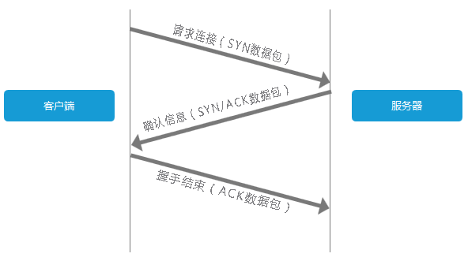
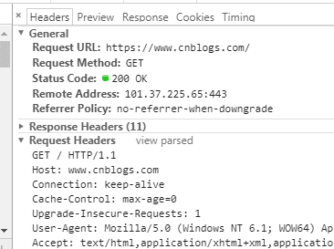
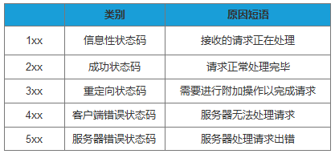
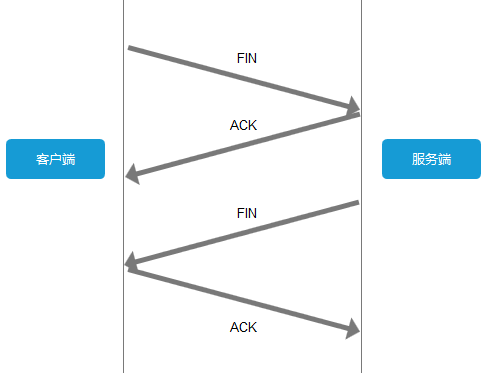

###   浏览器输入网址后会做什么

####  一、DNS域名解析

我们在浏览器输入网址，其实就是要向服务器请求我们想要的页面内容，所有浏览器首先要确认的是域名所对应的服务器在哪里。将域名解析成对应的服务器IP地址这项工作，是由DNS服务器来完成的。

客户端收到你输入的域名地址后，它**首先去找本地的hosts文件，检查在该文件中是否有相应的域名、IP对应关系，如果有，则向其IP地址发送请求，如果hosts里没有这个域名的映射，则查找本地DNS解析器缓存，是否有这个网址映射关系，如果有，直接返回，完成域名解析。**
如果hosts与本地DNS解析器缓存都没有相应的网址映射关系，首先会找TCP/ip参数中设置的首选DNS服务器，在此我们叫它本地DNS服务器，此服务器收到查询时，如果要查询的域名，包含在本地配置区域资源中，则返回解析结果给客户机，完成域名解析，此解析具有权威性。
如果要查询的域名，不由本地DNS服务器区域解析，但该服务器已缓存了此网址映射关系，则调用这个IP地址映射，完成域名解析，此解析不具有权威性。
如果本地DNS服务器本地区域文件与缓存解析都失效，则根据本地DNS服务器的设置（是否设置转发器）进行查询，如果未用转发模式，本地DNS就把请求发至13台根DNS，根DNS服务器收到请求后会判断这个域名(.com)是谁来授权管理，并会返回一个负责该顶级域名服务器的一个IP。本地DNS服务器收到IP信息后，将会联系负责.com域的这台服务器。这台负责.com域的服务器收到请求后，如果自己无法解析，它就会找一个管理.com域的下一级DNS服务器地址(qq.com)给本地DNS服务器。当本地DNS服务器收到这个地址后，就会找qq.com域服务器，重复上面的动作，进行查询，直至找到www.qq.com主机。
如果用的是转发模式，此DNS服务器就会把请求转发至上一级DNS服务器，由上一级服务器进行解析，上一级服务器如果不能解析，或找根DNS或把转请求转至上上级，以此循环。不管是本地DNS服务器用是是转发，还是根提示，最后都是把结果返回给本地DNS服务器，由此DNS服务器再返回给客户机。

#### 二、建立TCP链接

费了一顿周折终于拿到服务器IP了，**下一步自然就是链接到该服务器。对于客户端与服务器的TCP链接，必然要说的就是『三次握手』。**




客户端发送一个带有SYN标志的数据包给服务端，服务端收到后，回传一个带有SYN/ACK标志的数据包以示传达确认信息，最后客户端再回传一个带ACK标志的数据包，代表握手结束，连接成功。

上图也可以这么理解：

客户端：“你好，在家不，有你快递。”

服务端：“在的，送来就行。”

客户端：“好嘞。”

#### 三、发送HTTP请求

**与服务器建立了连接后，就可以向服务器发起请求了请求包括GET/POST、url、协议、浏览器头、cookies信息等**。这里我们先看下请求报文的结构（如下图）：


请求报文

在浏览器中查看报文首部（以google浏览器为例）：



请求行包括请求方法、URI、HTTP版本。首部字段传递重要信息，包括请求首部字段、通用首部字段和实体首部字段。我们可以从报文中看到发出的请求的具体信息。具体每个首部字段的作用，这里不做过多阐述。

#### 四、服务器处理请求

**服务器端收到请求后的由web服务器（准确说应该是http服务器）处理请求，诸如Apache、Ngnix、IIS等。web服务器解析用户请求，知道了需要调度哪些资源文件，再通过相应的这些资源文件处理用户请求和参数，并调用数据库信息，最后将结果通过web服务器返回给浏览器客户端。**


服务器处理请求

#### 五、返回响应结果

在HTTP里，有请求就会有响应，哪怕是错误信息。这里我们同样看下响应报文的组成结构：


响应报文


在响应结果中都会有个一个HTTP状态码，比如我们熟知的200、301、404、500等。通过这个状态码我们可以知道服务器端的处理是否正常，并能了解具体的错误。

状态码由3位数字和原因短语组成。根据首位数字，状态码可以分为五类：



状态码类别

#### 六、关闭TCP连接

**为了避免服务器与客户端双方的资源占用和损耗，当双方没有请求或响应传递时，任意一方都可以发起关闭请求。与创建TCP连接的3次握手类似，关闭TCP连接，需要4次握手。**



4次握手

上图可以这么理解：

客户端：“兄弟，我这边没数据要传了，咱关闭连接吧。”

服务端：“收到，我看看我这边有木有数据了。”

服务端：“兄弟，我这边也没数据要传你了，咱可以关闭连接了。”

客户端：“好嘞。”

#### 七、浏览器解析HTML

准确地说，浏览器需要加载解析的不仅仅是HTML，还包括CSS、JS。以及还要加载图片、视频等其他媒体资源。

浏览器通过解析HTML，生成DOM树，解析CSS，生成CSS规则树，然后通过DOM树和CSS规则树生成渲染树。渲染树与DOM树不同，渲染树中并没有head、display为none等不必显示的节点。

要注意的是，浏览器的解析过程并非是串连进行的，比如在解析CSS的同时，可以继续加载解析HTML，但在解析执行JS脚本时，会停止解析后续HTML，这就会出现阻塞问题，关于JS阻塞相关问题，这里不过多阐述,后面会单独开篇讲解。

#### 八、浏览器布局渲染

根据渲染树布局，计算CSS样式，即每个节点在页面中的大小和位置等几何信息。HTML默认是流式布局的，CSS和js会打破这种布局，改变DOM的外观样式以及大小和位置。这时就要提到两个重要概念：repaint和reflow。

> repaint：屏幕的一部分重画，不影响整体布局，比如某个CSS的背景色变了，但元素的几何尺寸和位置不变。
>
> reflow： 意味着元件的几何尺寸变了，我们需要重新验证并计算渲染树。是渲染树的一部分或全部发生了变化。这就是Reflow，或是Layout。

所以我们应该尽量减少reflow和repaint，我想这也是为什么现在很少有用table布局的原因之一。

最后浏览器绘制各个节点，将页面展示给用户。


### TCP三次握手，四次挥手


    序列号seq：占4个字节，用来标记数据段的顺序，TCP把连接中发送的所有数据字节都编上一个序号，第一个字节的编号由本地随机产生；给字节编上序号后，就给每一个报文段指派一个序号；序列号seq就是这个报文段中的第一个字节的数据编号。
    
    确认号ack：占4个字节，期待收到对方下一个报文段的第一个数据字节的序号；序列号表示报文段携带数据的第一个字节的编号；而确认号指的是期望接收到下一个字节的编号；因此当前报文段最后一个字节的编号+1即为确认号。
    
    确认ACK：占1位，仅当ACK=1时，确认号字段才有效。ACK=0时，确认号无效
    
    同步SYN：连接建立时用于同步序号。当SYN=1，ACK=0时表示：这是一个连接请求报文段。若同意连接，则在响应报文段中使得SYN=1，ACK=1。因此，SYN=1表示这是一个连接请求，或连接接受报文。SYN这个标志位只有在TCP建产连接时才会被置1，握手完成后SYN标志位被置0。
    
    终止FIN：用来释放一个连接。FIN=1表示：此报文段的发送方的数据已经发送完毕，并要求释放运输连接
    
    PS：ACK、SYN和FIN这些大写的单词表示标志位，其值要么是1，要么是0；ack、seq小写的单词表示序号。

字段 	含义
URG 	紧急指针是否有效。为1，表示某一位需要被优先处理
ACK 	确认号是否有效，一般置为1。
PSH 	提示接收端应用程序立即从TCP缓冲区把数据读走。
RST 	对方要求重新建立连接，复位。
SYN 	请求建立连接，并在其序列号的字段进行序列号的初始值设定。建立连接，设置为1
FIN     	希望断开连接。

 

**三次握手： **

（1）第一次握手：Client将标志位SYN置为1，随机产生一个值seq=J，并将该数据包发送给Server，Client进入SYN_SENT状态，等待Server确认。
 （2）第二次握手：Server收到数据包后由标志位SYN=1知道Client请求建立连接，Server将标志位SYN和ACK都置为1，ack=J+1，随机产生一个值seq=K，并将该数据包发送给Client以确认连接请求，Server进入SYN_RCVD状态。
 （3）第三次握手：Client收到确认后，检查ack是否为J+1，ACK是否为1，如果正确则将标志位ACK置为1，ack=K+1，并将该数据包发送给Server，Server检查ack是否为K+1，ACK是否为1，如果正确则连接建立成功，Client和Server进入ESTABLISHED状态，完成三次握手，随后Client与Server之间可以开始传输数据了。

 


**四次挥手： **

（1）第一次挥手：Client发送一个FIN，用来关闭Client到Server的数据传送，Client进入FIN_WAIT_1状态。

 （2）第二次挥手：Server收到FIN后，发送一个ACK给Client，确认序号为收到序号+1（与SYN相同，一个FIN占用一个序号），Server进入CLOSE_WAIT状态。

 （3）第三次挥手：Server发送一个FIN，用来关闭Server到Client的数据传送，Server进入LAST_ACK状态。

 （4）第四次挥手：Client收到FIN后，Client进入TIME_WAIT状态，接着发送一个ACK给Server，确认序号为收到序号+1，Server进入CLOSED状态，完成四次挥手。 	 

**常见面试题**

【问题1】为什么连接的时候是三次握手，关闭的时候却是四次握手？

答：因为当Server端收到Client端的SYN连接请求报文后，可以直接发送SYN+ACK报文。其中ACK报文是用来应答的，SYN报文是用来同步的。但是关闭连接时，当Server端收到FIN报文时，很可能并不会立即关闭SOCKET，所以只能先回复一个ACK报文，告诉Client端，"你发的FIN报文我收到了"。只有等到我Server端所有的报文都发送完了，我才能发送FIN报文，因此不能一起发送。故需要四步握手。

【问题2】为什么TIME_WAIT状态需要经过2MSL(最大报文段生存时间)才能返回到CLOSE状态？

答：虽然按道理，四个报文都发送完毕，我们可以直接进入CLOSE状态了，但是我们必须假象网络是不可靠的，有可以最后一个ACK丢失。所以TIME_WAIT状态就是用来重发可能丢失的ACK报文。在Client发送出最后的ACK回复，但该ACK可能丢失。Server如果没有收到ACK，将不断重复发送FIN片段。所以Client不能立即关闭，它必须确认Server接收到了该ACK。Client会在发送出ACK之后进入到TIME_WAIT状态。Client会设置一个计时器，等待2MSL的时间。如果在该时间内再次收到FIN，那么Client会重发ACK并再次等待2MSL。所谓的2MSL是两倍的MSL(Maximum Segment Lifetime)。MSL指一个片段在网络中最大的存活时间，2MSL就是一个发送和一个回复所需的最大时间。如果直到2MSL，Client都没有再次收到FIN，那么Client推断ACK已经被成功接收，则结束TCP连接。

【问题3】为什么不能用两次握手进行连接？

答：3次握手完成两个重要的功能，既要双方做好发送数据的准备工作(双方都知道彼此已准备好)，也要允许双方就初始序列号进行协商，这个序列号在握手过程中被发送和确认。

现在把三次握手改成仅需要两次握手，死锁是可能发生的。作为例子，考虑计算机S和C之间的通信，假定C给S发送一个连接请求分组，S收到了这个分组，并发 送了确认应答分组。按照两次握手的协定，S认为连接已经成功地建立了，可以开始发送数据分组。可是，C在S的应答分组在传输中被丢失的情况下，将不知道S 是否已准备好，不知道S建立什么样的序列号，C甚至怀疑S是否收到自己的连接请求分组。在这种情况下，C认为连接还未建立成功，将忽略S发来的任何数据分 组，只等待连接确认应答分组。而S在发出的分组超时后，重复发送同样的分组。这样就形成了死锁。

【问题4】如果已经建立了连接，但是客户端突然出现故障了怎么办？

TCP还设有一个保活计时器，显然，客户端如果出现故障，服务器不能一直等下去，白白浪费资源。服务器每收到一次客户端的请求后都会重新复位这个计时器，时间通常是设置为2小时，若两小时还没有收到客户端的任何数据，服务器就会发送一个探测报文段，以后每隔75秒钟发送一次。若一连发送10个探测报文仍然没反应，服务器就认为客户端出了故障，接着就关闭连接。

### tcp协议和udp协议的差别 

```
tcp协议和udp协议的差别 
           TCP           UDP 
是否连接     面向连接     面向非连接 
传输可靠性   可靠        不可靠 
应用场合    少量数据    传输大量数据 

速度       慢         快

```

**TCP定义**

 	TCP（Transmission Control Protocol 传输控制协议）是一种面向连接的、可靠的、基于字节流的传输层通信协议，由IETF的RFC 793定义。 

 


 	**UDP定义** 

 	UDP （User Datagram Protocol 用户数据报协议）是OSI（Open System Interconnection开放式系统互联） 参考模型中一种无连接的传输层协议，提供面向事务的简单不可靠信息传送服务 


TCP与UDP区别

 （1）TCP提供的是面向连接的、可靠的数据流传输；

​         UDP提供的是非面向连接的、不可靠的数据流传输。

 （2）TCP提供可靠的服务，通过TCP连接传送的数据，无差错、不丢失，不重复，按序到达；

​        UDP尽最大努力交付，即不保证可靠交付。

 （3）TCP面向字节流；

​        UDP面向报文。

 （4）TCP连接只能是点到点的；

​        UDP支持一对一、一对多、多对一和多对多的交互通信。

 （5） TCP首部开销20字节；

​        UDP的首部开销小，只有8个字节。

 （6）TCP的逻辑通信信道是全双工的可靠信道；

​        UDP的逻辑通信信道是不可靠信道。


 ###  列举几种常见的协议，并简述他们的作用             

ICMP协议：因特网控制报文协议。它是TCP/IP协议族的一个子协议，用于在IP主机、路由器之间传递控制消息。

 TFTP协议：是TCP/IP协议族中的一个用来在客户机与服务器之间进行简单文件传输的协议，提供不复杂、开销不大的文件传输服务。

 HTTP协议：超文本传输协议，是一个属于应用层的面向对象的协议，由于其简捷、快速的方式，适用于分布式超媒体信息系统。

 DHCP协议：动态主机配置协议，是一种让系统得以连接到网络上，并获取所需要的配置参数手段。

 NAT协议：网络地址转换属接入广域网(WAN)技术，是一种将私有（保留）地址转化为合法IP地址的转换技术，

 DHCP协议：一个局域网的网络协议，使用UDP协议工作，用途：给内部网络或网络服务供应商自动分配IP地址，给用户或者内部网络管理员作为对所有计算机作中央管理的手段。             


### 简述计算机网络中的七层模型             


 OSI分层      （7层）：物理层、数据链路层、网络层、传输层、会话层、表示层、应用层。
 TCP/IP分层（4层）：网络接口层、              网际层、运输层、                            应用层。
 五层协议     （5层）：物理层、数据链路层、网络层、运输层、                            应用层。

 **每一层的协议如下：**
 物理层：RJ45、CLOCK、IEEE802.3    （中继器，集线器，网关）
 数据链路：PPP、FR、HDLC、VLAN、MAC  （网桥，交换机）
 网络层：IP、ICMP、ARP、RARP、OSPF、IPX、RIP、IGRP、 （路由器）
 传输层：TCP、UDP、SPX
 会话层：NFS、SQL、NETBIOS、RPC
 表示层：JPEG、MPEG、ASII
 应用层：FTP、DNS、Telnet、SMTP、HTTP、WWW、NFS

 **每一层的作用如下：**

 物理层：通过媒介传输比特,确定机械及电气规范（比特Bit）
 数据链路层：将比特组装成帧和点到点的传递（帧Frame）
 网络层：负责数据包从源到宿的传递和网际互连（包PackeT）
 传输层：提供端到端的可靠报文传递和错误恢复（段Segment）
 会话层：建立、管理和终止会话（会话协议数据单元SPDU）
 表示层：对数据进行翻译、加密和压缩（表示协议数据单元PPDU）
 应用层：允许访问OSI环境的手段（应用协议数据单元APDU） 


 ### 简单介绍一下HTTP的长连接和短连接         

HTTP的长连接和短连接本质上是TCP长连接和短连接。HTTP属于应用层协议.

 	**短连接:**  

 	浏览器和服务器每进行一次HTTP操作，就建立一次连接，但任务结束就中断连接。 

 	**长连接:**  

 	当一个网页打开完成后，客户端和服务器之间用于传输HTTP数据的  TCP连接不会关闭，如果客户端再次访问这个服务器上的网页，会继续使用这一条已经建立的连接。Keep-Alive不会永久保持连接，它有一个保持时间，可以在不同的服务器软件（如Apache）中设定这个时间。实现长连接要客户端和服务端都支持长连接。 

 	**TCP短连接:**   

 	 client向server发起连接请求，server接到请求，然后双方建立连接。client向server发送消息，server回应client，然后一次读写就完成了，这时候双方任何一个都可以发起close操作，不过一般都是client先发起  close操作.短连接一般只会在 client/server间传递一次读写操作 

 	 **TCP长连接:**  

 	client向server发起连接，server接受client连接，双方建立连接。Client与server完成一次读写之后，它们之间的连接并不会主动关闭，后续的读写操作会继续使用这个连接。 


### 常见的HTTP状态码有哪些？             


**2开头 （请求成功）表示成功处理了请求的状态代码。**

 	200   （成功）  服务器已成功处理了请求。 通常，这表示服务器提供了请求的网页。   201   （已创建）  请求成功并且服务器创建了新的资源。  202   （已接受）  服务器已接受请求，但尚未处理。  203    （非授权信息）  服务器已成功处理了请求，但返回的信息可能来自另一来源。  204   （无内容）  服务器成功处理了请求，但没有返回任何内容。   205   （重置内容） 服务器成功处理了请求，但没有返回任何内容。 206   （部分内容）  服务器成功处理了部分 GET 请求。 

 	


**3开头 （请求被重定向）表示要完成请求，需要进一步操作。 通常，这些状态代码用来重定向。**

 	300    （多种选择）  针对请求，服务器可执行多种操作。 服务器可根据请求者 (user agent) 选择一项操作，或提供操作列表供请求者选择。   301   （永久移动）  请求的网页已永久移动到新位置。 服务器返回此响应（对 GET 或 HEAD  请求的响应）时，会自动将请求者转到新位置。 302   （临时移动）   服务器目前从不同位置的网页响应请求，但请求者应继续使用原有位置来进行以后的请求。 303   （查看其他位置） 请求者应当对不同的位置使用单独的  GET 请求来检索响应时，服务器返回此代码。 304   （未修改） 自从上次请求后，请求的网页未修改过。  服务器返回此响应时，不会返回网页内容。  305   （使用代理） 请求者只能使用代理访问请求的网页。  如果服务器返回此响应，还表示请求者应使用代理。  307   （临时重定向）   服务器目前从不同位置的网页响应请求，但请求者应继续使用原有位置来进行以后的请求。 


**4开头 （请求错误）这些状态代码表示请求可能出错，妨碍了服务器的处理。**

 	400    （错误请求） 服务器不理解请求的语法。  401   （未授权） 请求要求身份验证。 对于需要登录的网页，服务器可能返回此响应。  403    （禁止） 服务器拒绝请求。 404   （未找到） 服务器找不到请求的网页。 405   （方法禁用） 禁用请求中指定的方法。  406    （不接受） 无法使用请求的内容特性响应请求的网页。  407   （需要代理授权） 此状态代码与  401（未授权）类似，但指定请求者应当授权使用代理。 408   （请求超时）  服务器等候请求时发生超时。  409   （冲突）   服务器在完成请求时发生冲突。 服务器必须在响应中包含有关冲突的信息。  410   （已删除）   如果请求的资源已永久删除，服务器就会返回此响应。  411   （需要有效长度） 服务器不接受不含有效内容长度标头字段的请求。  412    （未满足前提条件） 服务器未满足请求者在请求中设置的其中一个前提条件。  413   （请求实体过大）  服务器无法处理请求，因为请求实体过大，超出服务器的处理能力。  414   （请求的 URI 过长） 请求的  URI（通常为网址）过长，服务器无法处理。  415   （不支持的媒体类型） 请求的格式不受请求页面的支持。  416    （请求范围不符合要求） 如果页面无法提供请求的范围，则服务器会返回此状态代码。  417   （未满足期望值）  服务器未满足"期望"请求标头字段的要求。 


**5开头（服务器错误）这些状态代码表示服务器在尝试处理请求时发生内部错误。 这些错误可能是服务器本身的错误，而不是请求出错。**

 500    （服务器内部错误）  服务器遇到错误，无法完成请求。  501   （尚未实施） 服务器不具备完成请求的功能。  例如，服务器无法识别请求方法时可能会返回此代码。  502   （错误网关） 服务器作为网关或代理，从上游服务器收到无效响应。  503    （服务不可用） 服务器目前无法使用（由于超载或停机维护）。 通常，这只是暂时状态。  504   （网关超时）   服务器作为网关或代理，但是没有及时从上游服务器收到请求。  505   （HTTP 版本不受支持） 服务器不支持请求中所用的 HTTP  协议版本。             


###  TCP的三次握手过程？为什么会采用三次握手，若采用二次握手可以吗？             

建立连接的过程是利用客户服务器模式，假设主机A为客户端，主机B为服务器端。

 （1）TCP的三次握手过程：主机A向B发送连接请求；主机B对收到的主机A的报文段进行确认；主机A再次对主机B的确认进行确认。

 （2）采用三次握手是为了防止失效的连接请求报文段突然又传送到主机B，因而产生错误。失效的连接请求报文段是指：主机A发出的连接请求没有收到主机B的确认，于是经过一段时间后，主机A又重新向主机B发送连接请求，且建立成功，顺序完成数据传输。考虑这样一种特殊情况，主机A第一次发送的连接请求并没有丢失，而是因为网络节点导致延迟达到主机B，主机B以为是主机A又发起的新连接，于是主机B同意连接，并向主机A发回确认，但是此时主机A根本不会理会，主机B就一直在等待主机A发送数据，导致主机B的资源浪费。

 （3）采用两次握手不行，原因就是上面说的实效的连接请求的特殊情况。             

  

### nginx与Apache的对比以及优缺点


简单的说apache  httpd和nginx都是web服务器，但两者适应的场景不同，也就是两者专注于解决不同的问题。apache  httpd:稳定、对动态请求处理强，但同时高并发时性能较弱，耗费资源多。

nginx：高并发处理能力强、擅长处理静态请求、反向代理、均衡负载。


 **1、**nginx相对于apache的优点： 轻量级，同样起web 服务，比apache  占用更少的内存及资源 ，抗并发，nginx 处理请求是异步非阻塞的，而apache 则是阻塞型的，在高并发下nginx  能保持低资源低消耗高性能，高度模块化的设计，编写模块相对简单 ，社区活跃，各种高性能模块出品迅速啊

apache 相对于nginx 的优点： rewrite ，比nginx 的rewrite 强大 ，模块超多，基本想到的都可以找到  少bug ，nginx 的bug 相对较多 超稳定。存在就是理由，一般来说，需要性能的web 服务，用nginx  。如果不需要性能只求稳定，那就apache 吧。后者的各种功能模块实现得比前者，例如ssl  的模块就比前者好，可配置项多。这里要注意一点，epoll(freebsd 上是 kqueue )网络IO 模型是nginx  处理性能高的根本理由，但并不是所有的情况下都是epoll 大获全胜的，如果本身提供静态服务的就只有寥寥几个文件，apache 的select  模型或许比epoll 更高性能。当然，这只是根据网络IO 模型的原理作的一个假设，真正的应用还是需要实测了再说的。

\##对于网络IO复用模型，我自己也不懂，但是参考百度百科对epoll解释的：epoll是Linux下多路复用IO接口select/poll的增强版本，它能显著提高程序在大量并发连接中只有少量活跃的情况下的系统CPU利用率，因为它会复用文件描述符集合来传递结果而不用迫使开发者每次等待事件之前都必须重新准备要被侦听的文件描述符集合，另一点原因就是获取事件的时候，它无须遍历整个被侦听的描述符集，只要遍历那些被内核IO事件异步唤醒而加入Ready队列的描述符集合就行了。从这点可以看出，nginx采用的epoll比select在算法理论上是更高效（为什么是理论上，我举个例子，对一个O(N)与O（N^2)的算法，如果要处理的数据规模是1或是很少，这两者能体现出效率差别吗？）另外一个就是select  IO模型对每个进程打开的文件描述符有限制，所以我才这个也是影响apache高并发时性能的一个因素。

​        **2、**作为 Web 服务器：相比 Apache，Nginx  使用更少的资源，支持更多的并发连接，体现更高的效率，这点使 Nginx  尤其受到虚拟主机提供商的欢迎。在高连接并发的情况下，Nginx是Apache服务器不错的替代品:  Nginx在美国是做虚拟主机生意的老板们经常选择的软件平台之一. 能够支持高达 50,000 个并发连接数的响应, 感谢Nginx为我们选择了  epoll and kqueue 作为开发模型.Nginx作为负载均衡服务器: Nginx 既可以在内部直接支持 Rails 和 PHP  程序对外进行服务, 也可以支持作为 HTTP代理 服务器对外进行服务. Nginx采用C进行编写, 不论是系统资源开销还是CPU使用效率都比  Perlbal 要好很多.作为邮件代理服务器: Nginx  同时也是一个非常优秀的邮件代理服务器（最早开发这个产品的目的之一也是作为邮件代理服务器）, Last.fm  描述了成功并且美妙的使用经验.Nginx 是一个安装非常的简单 , 配置文件非常简洁（还能够支持perl语法）, Bugs 非常少的服务器:  Nginx 启动特别容易, 并且几乎可以做到7*24不间断运行，即使运行数个月也不需要重新启动. 你还能够不间断服务的情况下进行软件版本的升级 .

\##nginx比apache支持更高的并发连接，效率更高，这与前面第一点说的有很大因素，两者网络IO模型不同，另一个就是nginx是异步处理请求，而apache是同步处理，每个进程对应一个请求。关于apache利用每个进程对应一个请求的的缺点后面还会讨论到。

​        **3、**Nginx 配置简洁, Apache 复杂 ，Nginx 静态处理性能比  Apache 高 3倍以上 ，Apache 对 PHP 支持比较简单，Nginx 需要配合其他后端用 ，Apache 的组件比 Nginx 多  ，现在 Nginx 才是 Web 服务器的首选

\##Nginx对动态处理请求弱，这个我想与它本身的实现有关吧，它需要与其他模块结合才能支持PHP等语言，而Apache则支持得较好，如果找到了底层实现的根本原因，欢迎留言指导~

​        **4、**最核心的区别在于apache是同步多进程模型，一个连接对应一个进程；nginx是异步的，多个连接（万级别）可以对应一个进程

\##两者处理请求的模型不同，直接导致了两点：a>nginx的抗并发能力强很多.  b>nginx对资源需求更少，由于apache进程与请求与一一对应，在请求很大时资源需求是很大的，而且进程创建销毁代价都很大的。不过现在好像做了改进，prefork可以根据需求预创建一些进行进程，这个有点类似线程池的概念。

​        **5、**nginx处理静态文件好,耗费内存少.但无疑apache仍然是目前的主流,有很多丰富的特性.所以还需要搭配着来.当然如果能确定nginx就适合需求,那么使用nginx会是更经济的方式.

\##这个应该与前面说的几点都有关系：nginx采用epoll IO复用模型；异步处理请求；线程与请求是一对多关系。

​        **6、**从个人过往的使用情况来看，nginx的负载能力比apache高很多。最新的服务器也改用nginx了。而且nginx改完配置能-t测试一下配置有没有问题，apache重启的时候发现配置出错了，会很崩溃，改的时候都会非常小心翼翼现在看有好多集群站，前端nginx抗并发，后端apache集群，配合的也不错。

\##在这点里面，我们主要关注这点：nginx+apache结合使用。既然两者各有优势，那我们就扬长避短，nginx做前端负责进行抗并发、负载均衡、做静态文件缓存，后端采用apache处理动态请求。

​       **7、**nginx处理动态请求是鸡肋，一般动态请求要apache去做，nginx只适合静态和反向。

\##nginx处理动态请求是鸡肋的原因谁能从原理方面帮解释一下？是不是由于对PHP这种语言支持不够好？对nginx适合做的就是静态请求和反向代理，反向代理是什么东东？简单的说是客户端将这nginx服务器就作为自己的目标机器，将请求发给nginx机器，至于nginx机器是将客户端需要的资源从哪里获得，客户端不在意（这就有区别与正向代理，在正向代理中是我不能访问目标机器，因为我将请求发给你代理机器，然后以你的名义去获得我需要的资源）。

​        **8、**從我個人的經驗來看，nginx是很不錯的前端服務器，負載性能很好，在老奔上開nginx，用webbench模擬10000個靜態文件請求毫不吃力。apache對php等語言的支持很好，此外apache有強大的支持網路，發展時間相對nginx更久，bug少但是apache有先天不支持多核心處理負載雞肋的缺點，建議使用nginx做前端，後端用apache。大型網站建議用nginx自代的集群功能

\## 这个还是在说nginx+apache结合是一个不错的选择。

​        **9、**Nginx优于apache的主要两点：1.Nginx本身就是一个反向代理服务器  2.Nginx支持7层负载均衡；其他的当然，Nginx可能会比apache支持更高的并发，但是根据NetCraft的统计，2011年4月的统计数据，Apache依然占有62.71%，而Nginx是7.35%，因此总得来说，Aapche依然是大部分公司的首先，因为其成熟的技术和开发社区已经也是非常不错的性能。

\##apache早出现，当初人们没选择，况且小压力的网址也用apache就足够应付请求压力，所以两者市场占有率是有差距的。

​        **10、**你对web  server的需求决定你的选择。大部分情况下nginx都优于APACHE，比如说静态文件处理、PHP-CGI的支持、反向代理功能、前端Cache、维持连接等等。在Apache+PHP（prefork）模式下，如果PHP处理慢或者前端压力很大的情况下，很容易出现Apache进程数飙升，从而拒绝服务的现象。

\##apache的缺陷，抗压不行，且由于线程数飙升，资源需求量也是极大

​         **11、**可以看一下nginx lua模块：https://github.com/chaoslaw...apache比nginx多的模块，可直接用lua实现apache是最流行的，why？大多数人懒得更新到nginx或者学新事物 
\##... 

​        **12、**对于nginx，我喜欢它配置文件写的很简洁，正则配置让很多事情变得简单运行效率高，占用资源少，代理功能强大，很适合做前端响应服务器

\##看了一下，nginx的配置文件确实更简洁，也容易理解

​         **13、**Apache在处理动态有优势，Nginx并发性比较好，CPU内存占用低，如果rewrite频繁，那还是Apache吧 
\##rewrite这点不是很了解，不多说 


### nginx与php通信

```
 www.example.com
        |
        |
      Nginx
        |
        |
路由到www.example.com/index.php

        |
        |
加载nginx的fast-cgi模块
        |
        |
fast-cgi监听127.0.0.1:9000地址
        |
        |
www.example.com/index.php请求到达127.0.0.1:9000
        |
        |
php-fpm 监听127.0.0.1:9000
        |
        |
php-fpm 接收到请求，启用worker进程处理请求
        |
        |
php-fpm 处理完请求，返回给nginx
        |
        |
nginx将结果通过http返回给浏览器
```

### php-fpm是什么

php-fpm即php-Fastcgi Process Manager.
php-fpm是 FastCGI 的实现，并提供了进程管理的功能。
进程包含 master 进程和 worker 进程两种进程。
master 进程只有一个，负责监听端口，接收来自 Web Server 的请求，而 worker 进程则一般有多个(具体数量根据实际需要配置)，每个进程内部都嵌入了一个 PHP 解释器，是 PHP 代码真正执行的地方。

### Apache是如何解析php文件的

我们常说的lamp架构是linux、apache、mysql、php，我们知道任何架构或者网站离不开数据库的支持，那么php和apache又是如何协同工作的呢？

php是apache的一个外挂程序，必须依靠web服务器才可以运行。当客户端浏览器触发事件--->php程序提交到apache服务器---->apache服务器根据php程序的特点判断是php程序，并从内存或者硬盘中提取访问所需要的应用程序，将其提交给php引擎程序--->php引擎程序解析并读取数据库生成相应的页面--->php引擎将html页面返回给web服务器，web服务器再将页面返回给客户端。

大致上这就是apache和php交互工作的过程。apache单独不能处理php代码，php（php  应用程序服务器）不能单独存在的，需要以apache为依托。也可以说php是apache功能模块的一种扩展，php作为apache的外挂，用于解  析php代码。经过解析的动态网页此时就不存在<?php  ?>了。当apache服务启动的同时也启动了php。也就是说php必须和apache安装在同一台服务器上，不可以分割。需要注意的是，mysql与apache无关，只是在响应php代码中的sql操作的时候才被访问。不需要与apache安装在同一台服务器上，可以单独存在，只需php远程连接即可。

### nginx是如何解析php文件的呢？

要想搞清楚nginx是如何与php协同工作的，先来了解一下cgi和fastcgi两个协议。CGI：common gateway interface，是web server与后台编程语言交互的一种协议。有了这个协议，开发者可以使用任何语言处理  Web Server 发来的请求，动态的生成内容。但 CGI 有一个致命的缺点，那就是每处理一个请求都需要 fork 一个全新的进程，随着  Web 的兴起，高并发越来越成为常态，这样低效的方式明显不能满足需求。就这样，FastCGI 诞生了，CGI  很快就退出了历史的舞台。FastCGI，顾名思义为更快的  CGI，它允许在一个进程内处理多个请求，而不是一个请求处理完毕就直接结束进程，性能上有了很大的提高。

PHP-CGI是PHP自带的FASTCGI管理器，但有很多的缺点。FPM同样也是fastcgi的实现，相比php-cgi有很多的优点。到了PHP5.3.3已经集成php-fpm了，不再是第三方的包了。PHP-FPM提供了更好的PHP进程管理方式，可以有效控制内存和进程、可以平滑重载PHP配置，只需要在./configure时，加上--enable-fpm。

FPM 是一个 PHP 进程管理器，包含 master 进程和 worker 进程两种进程：master  进程只有一个，负责监听端口，接收来自 Web Server 的请求，而 worker 进程则一般有多个  (具体数量根据实际需要配置)，每个进程内部都嵌入了一个 PHP 解释器，是 PHP 代码真正执行的地方。

从 FPM 接收到请求，到处理完毕，其具体的流程如下：

1.FPM 的 master 进程接收到请求

2.master 进程根据配置指派特定的 worker 进程进行请求处理，如果没有可用进程，返回错误，这也是我们配合 Nginx 遇到502错误比较多的原因。

3.worker 进程处理请求，如果超时，返回504错误

4.请求处理结束，返回结果

FPM 从接收到处理请求的流程就是这样了，那么Nginx 又是如何发送请求给fpm 的呢？这就需要Nginx 层面来说明了。

我们知道，Nginx 不仅仅是一个Web 服务器，也是一个功能强大的Proxy 服务器，除了进行http  请求的代理，也可以进行许多其他协议请求的代理，包括本文与fpm 相关的fastcgi 协议。为了能使Nginx 理解fastcgi  协议，Nginx 提供了fastcgi 模块来将http 请求映射为对应的 fastcgi 请求。

Nginx 的fastcgi 模块提供了fastcgi_param 指令来主要处理这些映射关系，除此之外，非常重要的就是  fastcgi_pass 指令了，这个指令用于指定 fpm 进程监听的地址，Nginx 会把所有的 php 请求翻译成 fastcgi  请求之后再发送到这个地址。

location ~ \.php$ {

include fastcgi_params;

fastcgi_pass unix:/tmp/www.sock;

\#fastcgi_pass 127.0.0.1:9000;

fastcgi_index index.php;

fastcgi_param SCRIPT_FILENAME /data/www$fastcgi_script_name;

}

在这个配置文件中，/tmp/www.sock  是php-fpm监听的socket文件，nginx通过location将所有的php文件，即http请求都交给fpm处理，实现了nginx和php的协同工作。

换言之，nginx就是作了fastcgi的一个代理，用fastcgi的方式结合使用了php。所以，需要开启php-fpm服务。

### rewrite

rewrite是一种服务器的重写脉冲技术，它可以使得服务器可以支持 URL 重写，是一种最新流行的服务器技术。它还可以实现限制特定IP访问网站的功能。